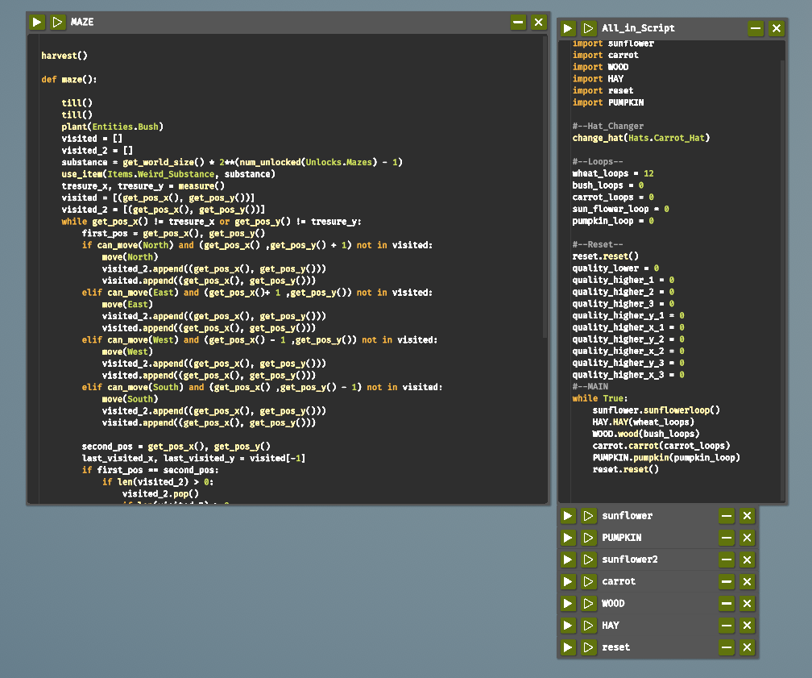
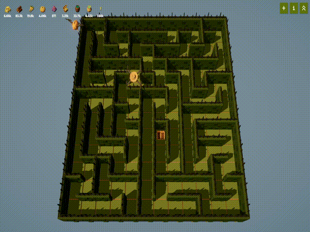
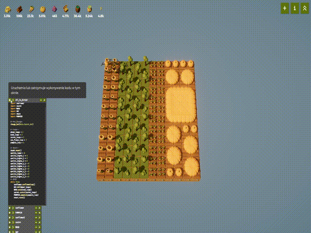

#  The Farmer Was Replaced - Autonomous Algorithms & Automation

Automation scripts and algorithmic logic implemented in Python for the game *"The Farmer Was Replaced"*. 

This repository demonstrates practical software engineering and robotics concepts, including **graph traversal (DFS)**, **explicit stack backtracking**, **priority queues**, and **toroidal grid navigation**.

---

##  Key Technical Highlights

###  1. Autonomous Maze Solver (`MAZE.py`)
- **Algorithm:** Depth-First Search (DFS) with a custom **Backtracking Stack**.
- **Mechanics:** Explores unseen path coordinates, tracks visited positions, and unwinds the navigation stack (`visited_2.pop()`) upon hitting dead ends until the treasure coordinates are reached.

###  2. Sunflower Priority Sorter (`sunflower.py`)
- **Algorithm:** Priority Queue simulation using tuple evaluation.
- **Mechanics:** Measures sunflower yields across the field, dynamically selects targets via `max()` evaluation on `(quality, x, y)` tuples, and harvests the highest-value crops first.
- **Navigation:** Custom **Torus Topology Navigation** that calculates the shortest wrapping distance across world boundaries (`world_size / 2`).

###  3. Dynamic Crop Repair System (`PUMPKIN.py`)
- **Pattern:** Fault Inspection & Task Queue Recovery.
- **Mechanics:** Scans crops for growth failures, queues dead plant coordinates (`dead_pumpkin_x/y`), and switches to a dedicated repair mode to replant and hydrate unharvestable tiles.

---

The number of loops in All_in_Script.py needs to be equal to the Y value of the map!

## 📁 Repository Structure

```text
├── All_in_Script.py   # Central loop controller and execution manager
├── MAZE.py            # Standalone DFS maze-solving algorithm
├── sunflower.py       # Priority sorting and toroidal navigation (started by All_in_Script)
├── PUMPKIN.py         # Dynamic fault inspection and crop repair (started by All_in_Script)
├── WOOD.py            # Alternating crop pattern optimization (started by All_in_Script)
├── HAY.py             # Basic resource harvesting script (started by All_in_Script)
├── carrot.py          # Soil-tilling and planting loop (started by All_in_Script)
└── reset.py           # Origin position reset sequence (started by All_in_Script)
*Remember about correctly naming scripts*
```




